Partner-Funded Credits is a comprehensive credit system that enables platforms to offer sponsored integrations, where partners like Stripe fund user setup costs through a flexible rules engine.

## What is Partner-Funded Credits?

Partner-Funded Credits solves a key platform challenge: **how to encourage users to integrate third-party services without charging them for initial setup costs**. 

Instead of users paying for prompts, API calls, or setup workflows, partners sponsor these costs to drive adoption of their services.

## Who is this for?

<CardGroup cols={2}>
  <Card title="Platform Teams" icon="building">
    **AI Code Generators** wanting users to integrate Stripe payments
    
    **Workflow Builders** encouraging Twilio SMS setups
    
    **Data Platforms** promoting Mapbox integrations
    
    Any platform with costly setup flows that benefit from partner sponsorship
  </Card>
  <Card title="Integration Partners" icon="handshake">
    **Stripe** sponsoring payment setup prompts
    
    **Twilio** funding SMS configuration workflows
    
    **Mapbox** covering geocoding API costs during onboarding
    
    Any service wanting to subsidize user acquisition costs
  </Card>
</CardGroup>

## Architecture

```mermaid
graph TB
    User[👤 User] --> Platform[🏢 Platform]
    Platform --> PFC[Partner-Funded Credits]
    Partner[🤝 Partner] --> PFC
    
    subgraph "PFC System"
        Auth[🔐 Supabase Auth]
        DB[🗄️ Postgres + RLS]
        Edge[⚡ Edge Functions]
        Rules[📋 Rules Engine]
        Webhooks[🔗 Webhooks]
        Billing[💰 Billing]
    end
    
    PFC --> Analytics[📊 Analytics & Reporting]
```



### Core Components

- **🔐 Supabase Auth & RLS**: Secure user authentication and row-level security
- **⚡ Edge Functions**: Serverless API handling credits, integrations, and billing
- **📋 Rules Engine**: Flexible JSON-based sponsorship rules and caps
- **🔗 Webhooks**: Real-time partner event processing for bonus grants
- **💰 Billing System**: Automated partner invoicing and budget management

## Key Features

<CardGroup cols={3}>
  <Card title="For Platforms" icon="sparkles">
    **Zero Setup Cost**: Users don't pay for integration setup prompts
    
    **Seamless Integration**: Drop-in SDK with TypeScript support
    
    **Real-time Balance**: Live credit tracking and wallet management
    
    **Demo Mode**: Test flows without partner agreements
  </Card>
  <Card title="For Partners" icon="target">
    **Targeted Sponsorship**: Fund specific integration phases
    
    **Budget Controls**: Monthly caps and automated cutoffs
    
    **Detailed Reporting**: Usage analytics and ROI tracking
    
    **Flexible Billing**: Automated invoicing with CSV/PDF exports
  </Card>
  <Card title="Security & Reliability" icon="shield">
    **Row-Level Security**: Every operation is user-scoped
    
    **Idempotency**: Safe retries with duplicate prevention
    
    **Fraud Detection**: Automated abuse prevention
    
    **Audit Trail**: Complete transaction history
  </Card>
</CardGroup>

## How it Works

### 1. Base Grant 🎁
When users verify an integration (e.g., connect Stripe), they receive base credits:

```bash
curl -H "Authorization: Bearer $ANON" \
  -H "Idempotency-Key: verify-123" \
  -d '{"project_id":"proj_123","mode":"test","account_id":"acct_stripe"}' \
  "$API/v1/integrations/stripe/verify"
# Response: { "verified": true, "grant": { "amount": 1000 }, "balance": 1000 }
```

### 2. Sponsored Setup 💰
During setup flows, partner-funded vouchers cover costs:

```bash
# Get voucher
curl -H "Authorization: Bearer $ANON" \
  -d '{"project_id":"proj_123","partner":"stripe","phase":"integration_setup","cap":300,"ttl_sec":900}' \
  "$API/v1/vouchers"

# Use voucher (net cost = $0)
curl -H "Authorization: Bearer $ANON" \
  -H "X-PF-Voucher: $JWT_VOUCHER" \
  -d '{"project_id":"proj_123","units":50,"context":{"phase":"integration_setup"}}' \
  "$API/v1/usage/burn"
```

### 3. Event-Gated Bonus 🎉  
First live events trigger bonus credits:

```bash
# Webhook from partner
curl -H "Idempotency-Key: evt-123" \
  -d '{"type":"checkout.session.completed","account_id":"acct_123","project_id":"proj_123"}' \
  "$API/webhooks/stripe"
# Response: { "ok": true, "bonus_grant": 500 }
```

### 4. Regular Usage ⚡
Normal operations consume credits:

```bash
curl -H "Authorization: Bearer $ANON" \
  -H "Idempotency-Key: burn-456" \
  -d '{"project_id":"proj_123","units":25,"context":{"feature":"code_generation"}}' \
  "$API/v1/usage/burn"
# Response: { "balance": 1425, "tx_id": "tx_789" }
```

## Getting Started

<CardGroup cols={2}>
  <Card title="Platform Integration" icon="code" href="/quickstart/platform">
    Get your platform integrated with Partner-Funded Credits in minutes
  </Card>
  <Card title="Partner Integration" icon="chart-line" href="/quickstart/partner">
    Start sponsoring integrations and tracking ROI
  </Card>
</CardGroup>

## What's Next?

- Explore our [Quickstart Guides](/quickstart/platform) to get up and running
- Review the [API Reference](/api-reference/overview) for detailed endpoint documentation  
- Check out [Security Model](/guides/security-model) for production considerations
- Browse [Troubleshooting](/troubleshooting) for common issues and solutions